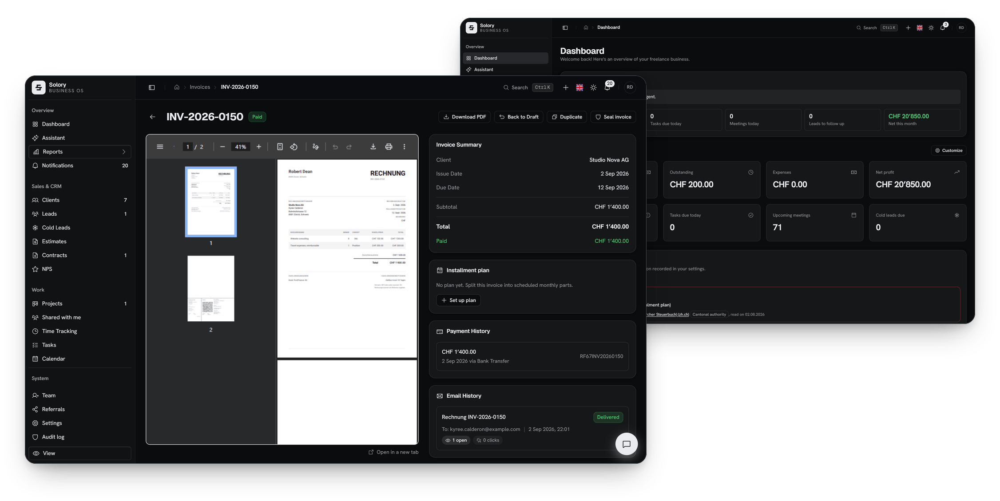
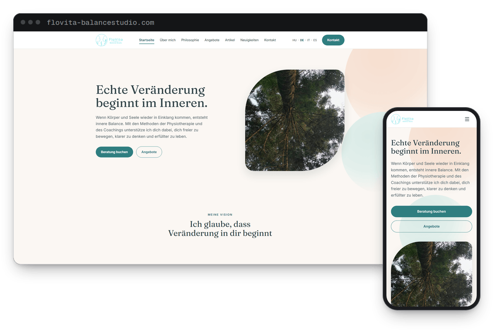
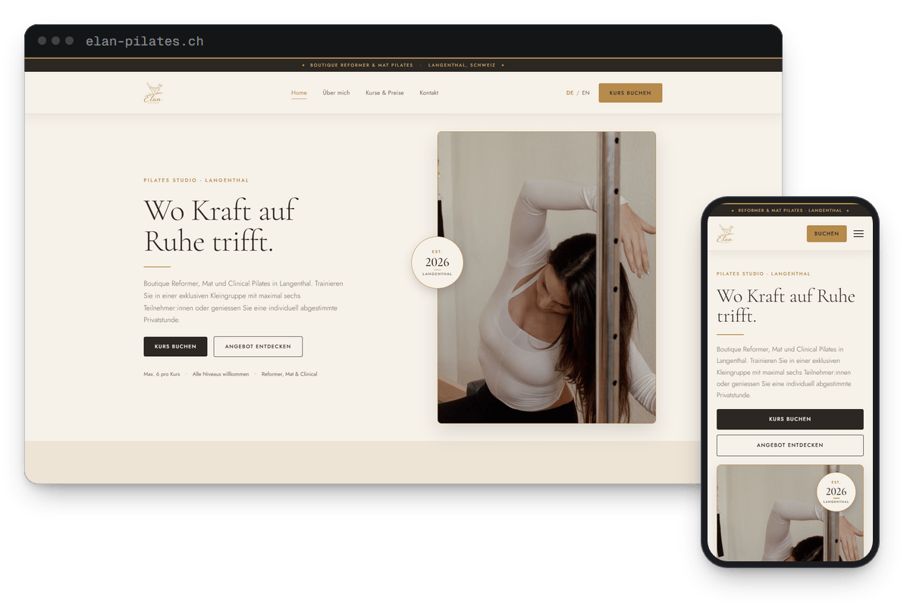
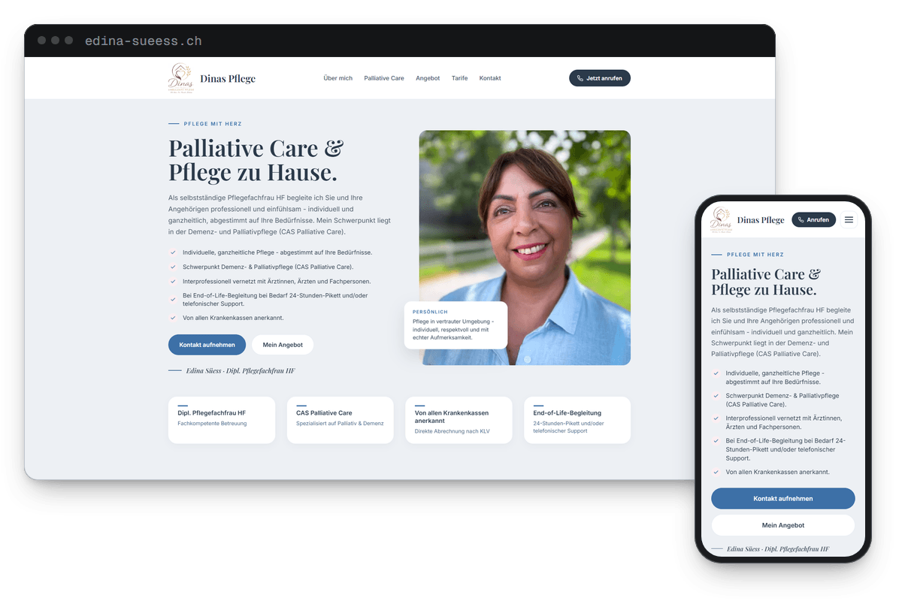
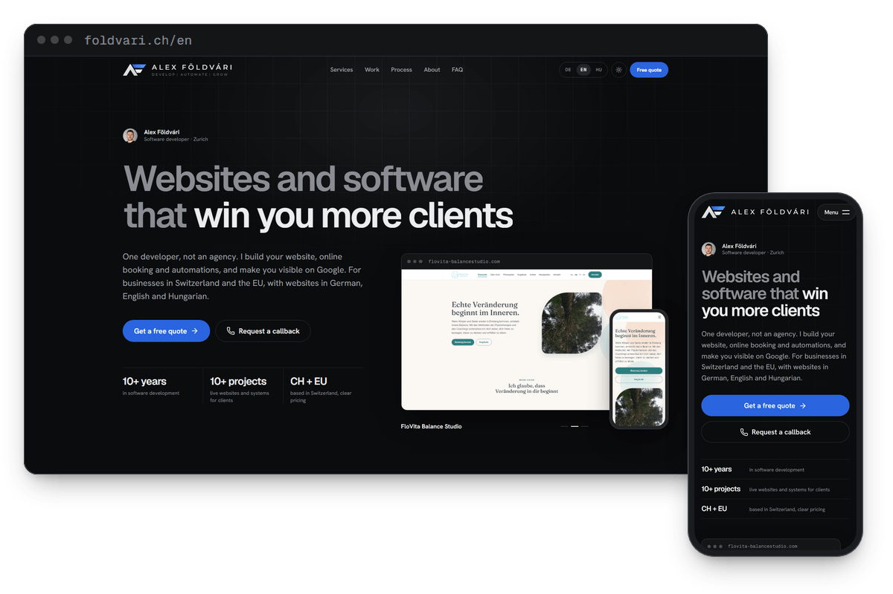

  <a href="https://foldvari.ch/en">
    <picture>
      <source media="(prefers-color-scheme: dark)" srcset="assets/header-dark.svg">
      <source media="(prefers-color-scheme: light)" srcset="assets/header-light.svg">
      
    </picture>
  </a>

  <a href="https://foldvari.ch/en"><b>foldvari.ch</b></a>
  &nbsp;·&nbsp;
  <a href="https://foldvari.ch/cv"><b>CV</b></a>
  &nbsp;·&nbsp;
  <a href="https://www.solory.ch"><b>Solory</b></a>
  &nbsp;·&nbsp;
  <a href="https://www.linkedin.com/in/foldvarialex/"><b>LinkedIn</b></a>
  &nbsp;·&nbsp;
  <a href="mailto:alex@foldvari.ch"><b>Email</b></a>

I'm Alex, a Frontend / Full-Stack Developer in the Zürich area. I build web applications end to end, from the interface to the API, the database and deployment, mostly with TypeScript, React, Next.js, Angular and Node.js. Since April 2026 I run my own registered software business in Switzerland and build [Solory](#solory), a SaaS product for Swiss sole traders.

## At a glance

- **Now:** registered software business in Switzerland since April 2026, building Solory
- **Before:** Dynex Kft, Budapest · HelixLab Kft, Pécs
- **Experience:** building software for 10+ years (self-taught start), professionally since 2022
- **Core stack:** TypeScript · React · Next.js · Angular · Node.js · Supabase
- **Languages:** Hungarian (native) · English (B2) · German (basic, A1-A2, improving)
- **Recognition:** 1st place at Óbuda University's 62nd Scientific Students' Conference (Nov 2025) with an AI-based system that digitalizes and automates hospitality venues
- **Open to:** Frontend or Full-Stack roles in the Zürich area, and freelance projects

Public repositories: [foldvari.ch source](https://github.com/foldvarialex/foldvari.ch) · [Solory case study](https://github.com/foldvarialex/solory)

## Work

### Solory

**The operating system for Swiss sole traders.** Founder and sole developer · `2026` · waitlist open, launching soon.

Product UI with demo data

- Swiss QR invoicing, clients, time tracking, expenses and contracts in one workspace
- camt.053 bank reconciliation that matches incoming payments to their invoices
- An AI assistant that drafts email replies and prepares multi-step actions, and never executes anything without approval

<picture>
  <source media="(prefers-color-scheme: dark)" srcset="assets/solory-flow-dark.svg">
  <source media="(prefers-color-scheme: light)" srcset="assets/solory-flow-light.svg">
  
</picture>

**Stack:** Next.js · React · TypeScript · Supabase (PostgreSQL) · CSS Modules · OpenAI API · Mailgun · Vitest · Playwright · Vercel

[solory.ch](https://www.solory.ch) · [Case study repository](https://github.com/foldvarialex/solory)

### Client work

Live sites for businesses in Switzerland.

  
  
  

- **[FloVita Balance Studio](https://www.flovita-balancestudio.com/de)** · Rotkreuz ZG · `2026` · physiotherapy and life coaching studio, four languages, blog and booking-ready contact form
- **[Élan Pilates](https://www.elan-pilates.ch/)** · Langenthal BE · `2026` · boutique Pilates studio, German and English, class and pricing pages, Eversports booking
- **[Dinas Pflege](https://www.edina-sueess.ch/)** · Erlinsbach SO · `2026` · self-employed nurse in home and palliative care, German, transparent tariff table

All references with descriptions: [foldvari.ch/en#references](https://foldvari.ch/en#references)

### foldvari.ch

Portfolio and business site in German, English and Hungarian. The source is public: [foldvarialex/foldvari.ch](https://github.com/foldvarialex/foldvari.ch).

  

- React 19, Vite and React Router, with a custom build step that prerenders every route in the sitemap to static HTML
- DE/EN/HU routes with hreflang, JSON-LD, a strict Content Security Policy and region-aware cookie consent for analytics
- Serverless lead API with validation shared by client and server, and an admin dashboard with scrypt hashing and optional TOTP

## Experience

<picture>
  <source media="(prefers-color-scheme: dark)" srcset="https://raw.githubusercontent.com/foldvarialex/foldvarialex/output/timeline-dark.svg">
  <source media="(prefers-color-scheme: light)" srcset="https://raw.githubusercontent.com/foldvarialex/foldvarialex/output/timeline-light.svg">
  
</picture>

**Full-Stack Developer / Software Engineer** · Self-employed, Zürich 
`Apr 2026 - present`

- Web applications, booking systems and business tools for clients in Switzerland and the EU
- Building Solory: Swiss QR-bill invoicing, camt.053 bank reconciliation and an approval-gated AI assistant (Next.js, TypeScript, Supabase)

**Full-Stack Developer / Technical Lead** · Dynex Kft, Budapest 
`May 2025 - Mar 2026`

- Full-Stack development and configuration of GoHighLevel-based systems for multiple client projects
- Customer-facing ordering, booking and reservation apps, including a visual table reservation system with real-time status
- AI chatbots and voice assistants through custom webhooks (Vapi.ai), plus automation tools for platform setup
- Technical coordination: requirement analysis, task planning and review of implementation results

**Studies and own projects** 
`Apr 2024 - Apr 2025`

Finished the Software Developer and Tester vocational qualification, started the BSc at Óbuda University and built personal projects.

**Frontend Developer (Angular)** · HelixLab Kft, Pécs 
`Jan 2022 - Mar 2024`

- Angular applications in a Scrum team, with UI components built from specifications and designs
- REST API integration, PDF generation, invoicing and email templates
- Google Drive, Google Chat and Smartsheet integrations with custom statistics and editing features

Full CV: [English](https://foldvari.ch/cv) · [Deutsch](https://foldvari.ch/lebenslauf) · [Magyar](https://foldvari.ch/oneletrajz)

## Education and recognition

- **1st place, university research competition** (62nd Scientific Students' Conference, Óbuda University) · `Nov 2025` 
  Digitalization and Technology Trends Section. Topic: comprehensive digitalization and automation of hospitality venues with an AI-based software system.
- **BSc Business Informatics**, Óbuda University, Budapest · `Sep 2024 - present`
- **Software Developer and Tester** (OKJ, Hungarian state-recognized vocational qualification), Baranya County SzC Radnóti Miklós Economics Technical School · `2022 - 2024`

<b>Earlier</b>

 

- **Graduation as Economist of Information Technology**, plus the **Office IT Specialist** partial qualification, Radnóti Miklós Economics Technical School · `2018 - 2022`
- **Software Developer** course (`2021 - 2022`) and **Frontend Developer** course (`2021`), HelixLab Kft
- **ECDL** certification, Neumann János Computer Science Society · `2018 - 2019`

## Stack

<picture>
  <source media="(prefers-color-scheme: dark)" srcset="assets/stack-dark.svg">
  <source media="(prefers-color-scheme: light)" srcset="assets/stack-light.svg">
  
</picture>

<b>Stack as text</b>

 

**Core**

- TypeScript · JavaScript · React · Next.js · Angular · HTML · CSS/SCSS · Tailwind CSS · Node.js · Supabase

**Used in real projects**

- PHP · Vite · Framer Motion · shadcn/ui · PostgreSQL · Neon · Firebase · MongoDB · REST APIs · OpenAI API · Vapi.ai · Stripe · Swiss QR-bill · Számlázz.hu · Resend · GoHighLevel · Smartsheet · Google APIs · Git · GitHub Actions · Vercel · Playwright · Vitest · Figma

**Familiar**

- Python · Java · C# · React Native · Three.js · MySQL · Redis · Spring Boot · Claude API · Gemini API · n8n · Docker · Photoshop

**Ways of working:** Scrum · Jira · requirement analysis · task planning · mentoring and knowledge sharing

## Activity

<picture>
  <source media="(prefers-color-scheme: dark)" srcset="https://raw.githubusercontent.com/foldvarialex/foldvarialex/output/activity-dark.svg">
  <source media="(prefers-color-scheme: light)" srcset="https://raw.githubusercontent.com/foldvarialex/foldvarialex/output/activity-light.svg">
  
</picture>

Generated from my contribution data and refreshed daily by a GitHub Action in this repository.

## Contact

- **Email:** [alex@foldvari.ch](mailto:alex@foldvari.ch)
- **Contact form:** [foldvari.ch/en#contact](https://foldvari.ch/en#contact)
- **CV:** [English](https://foldvari.ch/cv) · [Deutsch](https://foldvari.ch/lebenslauf) · [Magyar](https://foldvari.ch/oneletrajz)
- **Portfolio:** [English](https://foldvari.ch/en) · [Deutsch](https://foldvari.ch/) · [Magyar](https://foldvari.ch/hu)
- **LinkedIn:** [in/foldvarialex](https://www.linkedin.com/in/foldvarialex/)

 

  <a href="https://foldvari.ch/en">
    <picture>
      <source media="(prefers-color-scheme: dark)" srcset="assets/mark-dark.svg">
      <source media="(prefers-color-scheme: light)" srcset="assets/mark-light.svg">
      
    </picture>
  </a>

